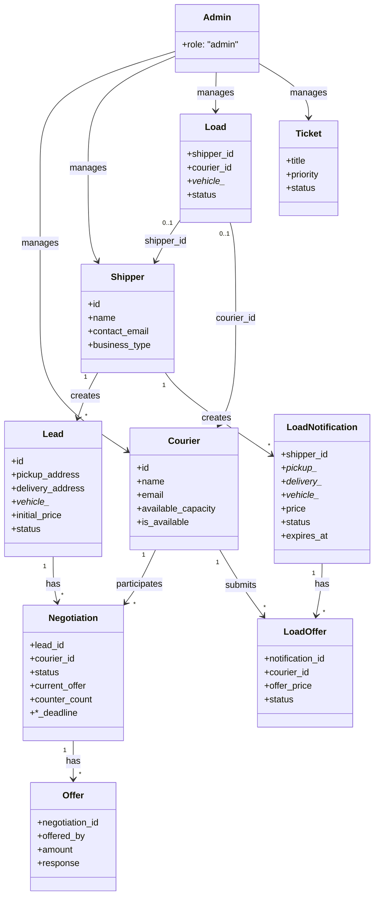
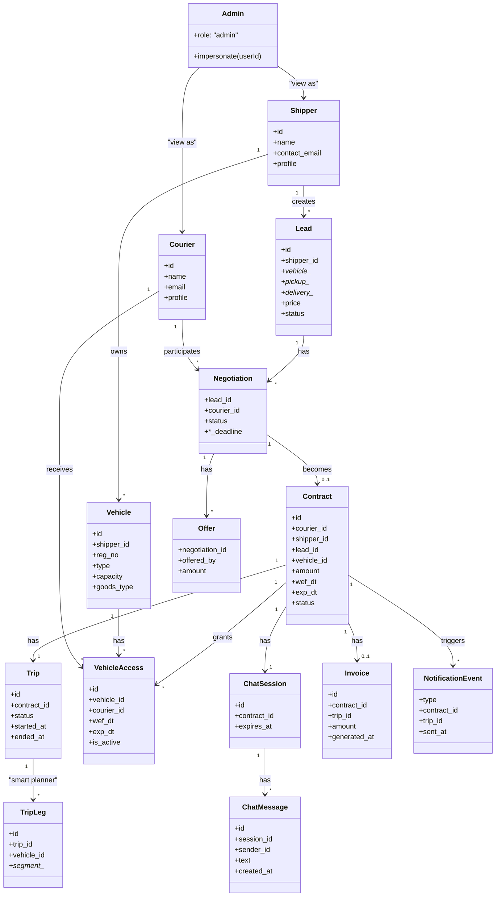

# Class Diagram (Domain Model)

Domain model in Mermaid: current state (as implemented) and target state (with Contract, Vehicle, Trip, VehicleAccess, Chat, Invoice, etc.).

---

## Current State (As Implemented)

---

## Target State (With New Domain Concepts)

---

## Notes

- **Current**: No Contract, Vehicle, Trip, VehicleAccess, Chat, or Invoice; Lead/Negotiation/Offer and LoadNotification/LoadOffer represent the shipper-post, courier-bid flow.
- **Target**: Contract links Courier and Shipper to a Vehicle and time window; VehicleAccess is time-bound (wef_dt, exp_dt); Trip (and optional TripLeg for smart planner) links to Contract; ChatSession has expires_at for time-limited bidding/chat; Invoice is generated from Contract/Trip; NotificationEvent represents lifecycle emails (agreement, trip start/end, etc.).
