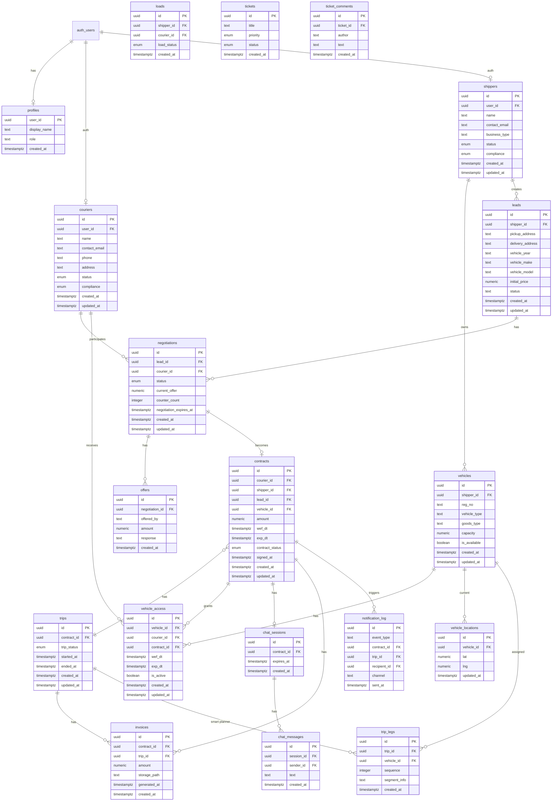

# ER Diagram (Database)

Target schema and relation to current schema. Diagrams are in Mermaid.

---

## Target Schema (Canonical)

---

## Enums (Target)

| Enum | Values |
|------|--------|
| `contract_status` | draft, signed, active, completed, cancelled |
| `trip_status` | scheduled, in_progress, completed, cancelled |
| `vehicle_access_status` | active, expired, revoked |
| `negotiation_status` | pending, negotiating, accepted, declined, expired, timeout |
| `load_status` | pending, in-transit, delivered, cancelled |
| `ticket_status` | open, in-progress, resolved, closed |
| `ticket_priority` | low, medium, high, urgent |

---

## Indexes (Recommended)

- `contracts(courier_id)`, `contracts(shipper_id)`, `contracts(exp_dt)`
- `vehicle_access(vehicle_id)`, `vehicle_access(courier_id)`, `vehicle_access(exp_dt)`, `vehicle_access(is_active)`
- `trips(contract_id)`, `trips(trip_status)`
- `chat_sessions(contract_id)`, `chat_sessions(expires_at)`
- `vehicle_locations(vehicle_id)`, `vehicle_locations(updated_at)`
- `notification_log(contract_id)`, `notification_log(sent_at)`

---

## Current vs Target Migration Map

| Current | Target | Action |
|---------|--------|--------|
| `auth.users` | Same | Keep |
| `profiles` | Same + optional `role` | Migrate if needed |
| `couriers` (Shipper + Admin schemas) | Single `couriers` + `user_id` to auth | Consolidate, add `user_id` |
| `shippers` | Same + `user_id` to auth | Add `user_id` |
| `leads` | Same (or rename to `shipment_requests`) | Keep; ensure `shipper_id` |
| `negotiations`, `offers` | Same | Keep |
| `load_notifications`, `load_offers` | Keep or consolidate with leads/negotiations | Document overlap; optionally merge |
| `loads` | Same | Keep (admin operational load) |
| (none) | `vehicles` | **New** table |
| (none) | `contracts` | **New** table |
| (none) | `trips` | **New** table |
| (none) | `trip_legs` | **New** (smart planner) |
| (none) | `vehicle_access` | **New** table |
| (none) | `chat_sessions`, `chat_messages` | **New** tables |
| (none) | `invoices` | **New** table |
| (none) | `vehicle_locations` | **New** table |
| (none) | `notification_log` | **New** table |
| `tickets`, `ticket_comments` | Same | Keep |
