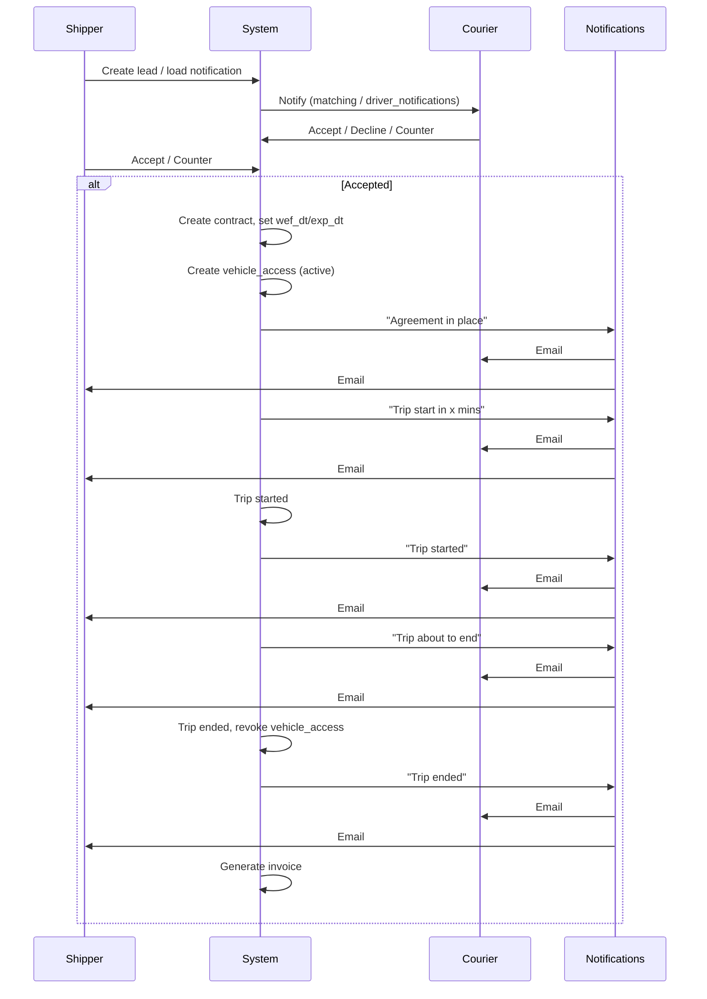

# Flows: Current and Optional

This document states the **current** business flow, **optional** flows (courier catalog, courier-post/shipper-bid), and which flows are in scope for **v1**.

---

## 1. Current Flow (Implemented)

**Shipper posts, Courier bids.**

1. **Shipper** creates a **lead** (or **load notification**): pickup/delivery, vehicle details, price, expiry.
2. **System** matches and notifies **couriers** (e.g. via `matching_requests`, `driver_notifications`, or `load_notifications`).
3. **Courier** sees the load/lead and can:
   - Accept (at offered price),
   - Decline,
   - Counter (submit an offer).
4. **Shipper** sees counter-offers and can accept, decline, or counter again. **Negotiation** state: pending → negotiating → accepted | declined | expired.
5. When **accepted**, the system can create a **contract** (target) and grant **vehicle access** for the agreed period. Courier can then see vehicle location and basic info until access expires.

**Dashboards today**:
- **Shipper dashboard**: Post leads, manage matching, view and respond to negotiations/offers.
- **Courier dashboard**: View load notifications/offers, accept/decline/counter, view own negotiations.

This flow is **in scope for v1** and is the primary flow to support with the new entities (Contract, VehicleAccess, Trip, Chat, Invoice, Notifications).

---

## 2. Optional Flow A: Courier Catalog (Browse Shippers/Vehicles)

**Courier browses available shippers and vehicles; requests or selects.**

- **Shipper** (or admin) registers **vehicles** with: type, capacity, goods type, wage/rate, availability window.
- **Courier** sees a **catalog**: list of shippers and their available vehicles (and wage, time, goods).
- **Courier** selects a shipper/vehicle and sends a **request** (or opens a negotiation). Shipper then accepts or counters.

**Difference from current**: Discovery is **courier-pull** (browse catalog) instead of **shipper-push** (shipper posts, courier gets notified). Both can coexist: shipper can still post leads, and courier can still browse a catalog of available vehicles.

**v1 scope**: **Optional / phase 2**. Document and design (e.g. `vehicles` table, catalog API); implement only if client confirms.

---

## 3. Optional Flow B: Courier Posts Goods, Shipper Bids

**Courier posts a shipment request; shippers bid.**

- **Courier** creates a **shipment request** (goods, origin, destination, time window, budget).
- **System** notifies **shippers** (or shippers browse open requests).
- **Shippers** submit **bids** (price, vehicle, time). Courier sees bids and accepts one (or negotiates).

**Difference from current**: Direction is reversed (courier posts, shipper bids). Would require:
- New entity (e.g. `courier_shipment_requests` or reuse `leads` with a `posted_by` role),
- **Shipper dashboard** to list and bid on courier-posted requests.

**v1 scope**: **Optional / phase 2**. Document only; implement only if client confirms.

---

## 4. Summary: What Is in Scope for v1

| Flow | Description | v1 |
|------|-------------|----|
| **Current** | Shipper posts leads/loads → Couriers notified → Couriers bid/negotiate → Accept → Contract + vehicle access + trip + invoice | **Yes** |
| **Optional A** | Courier catalog: browse shippers/vehicles, request/negotiate | No (phase 2) |
| **Optional B** | Courier posts shipment → Shippers bid | No (phase 2) |

---

## 5. Flow Diagram (Current + Contract/Trip Lifecycle)

---

## 6. Time-Limited Bidding/Chat (v1)

- **Chat** (or bargaining) linked to a negotiation or contract can be **time-limited** (e.g. 30 minutes from creation).
- **Implementation**: `chat_sessions.expires_at`; API and UI reject new messages and hide chat after expiry.
- **Negotiation** already has deadlines (`negotiation_expires_at`, `courier_response_deadline`, `shipper_response_deadline`); keep and enforce. Optional: align chat window with negotiation window (e.g. same 30-minute window).
