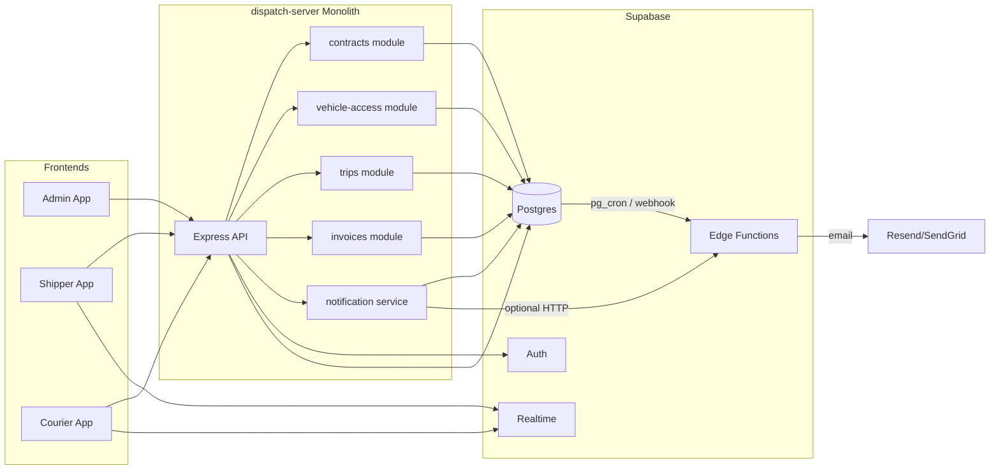

# How We Plan to Connect Modules (or Microservices)

Given the recommendation to **stay monolith + Supabase**, this document describes how modules connect inside the monolith and how optional async jobs (notifications, vehicle access revoke) fit in. It also outlines how a future split could look.

---

## 1. Monolith: Modules as Route Groups and Services

- **Modules** are route groups and service layers inside `dispatch-server` (e.g. `routes/contracts.ts`, `routes/vehicle-access.ts`, `services/notificationService.ts`). They share one Supabase client and one DB.
- **No service-to-service HTTP**: All calls are in-process (e.g. contract service creates vehicle_access records in the same process).
- **Optional Edge Functions**: Supabase Edge Functions can be triggered by DB events (e.g. `contracts` insert) or by cron to send emails or revoke vehicle access. The monolith does not "call" these over HTTP for core writes; it may call an Edge Function URL for "send notification" if desired, or the Edge Function subscribes to DB changes.

---

## 2. Event / API Boundaries (If We Split Later)

If we later extract services, logical boundaries would be:

| Event / trigger | Producer | Consumer (example) |
|-----------------|----------|---------------------|
| Contract signed | Contracts service | Notification service (email); Vehicle-access service (grant access) |
| Trip started | Trips service | Notification service (email) |
| Trip about to end | Trips service or cron | Notification service (email) |
| Trip ended | Trips service | Notification service (email); Vehicle-access service (revoke); Invoices service (generate) |
| exp_dt passed | Cron or Vehicle-access service | Vehicle-access service (set is_active = false) |

Communication could be:
- **Sync**: HTTP from contracts to notification (fire-and-forget) or to vehicle-access (grant).
- **Async**: Queue (e.g. Supabase pg_cron + Edge Function, or external queue) for emails and revoke.

No such split is planned for v1; this is for future reference.

---

## 3. Frontend to Backend

- **Admin**: All calls to `dispatch-server` (e.g. `VITE_API_BASE_URL` → `http://localhost:4000/api`). Optional: `X-Impersonate-User-Id` for "view as" courier/shipper.
- **Shipper / Courier**: Either (a) continue Supabase client + Realtime for negotiations/offers/chat and add REST calls to dispatch-server for contracts, trips, vehicle-access, invoices; or (b) route all through dispatch-server with Realtime still via Supabase subscriptions. Diagram above shows hybrid (API + Realtime).

---

## 4. Summary

- **Current plan**: Single monolith; modules are routes + services; one DB; optional Edge Functions for notifications and access revoke.
- **Connections**: Frontends → Express API → Supabase (DB, Auth, Realtime); optional DB/cron → Edge Functions → email provider.
- **No inter-service HTTP or message bus** within the app for v1.
